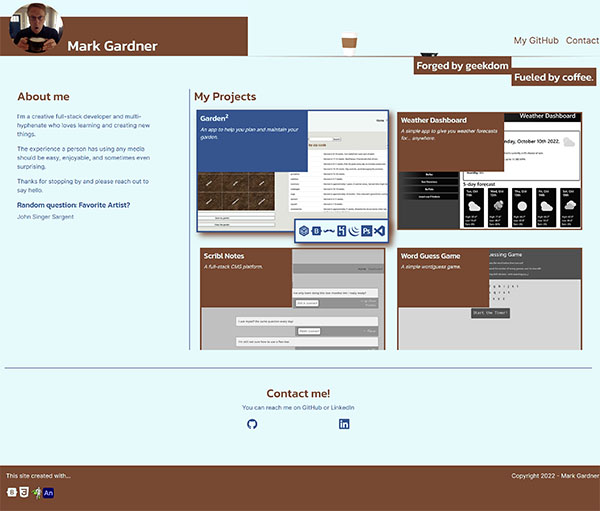
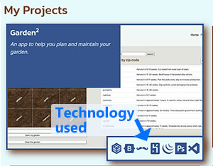

# Personal Portfolio - v2

## An update of my portfolio page using some of the new techniques we've learned since version 1.

___

This is a personal project to update my professional portfolio to show some of the skills I've learned as well as some of the projects I've worked on along the way.

This turned in to an iteration of the first version because in all honesty I liked how it turned out. There are just a few more things that I wanted to add to spice things up. I was especially interested in trying to learn some simple animation techniques to fulfill some ideas that popped into my head late one night. 

Let's see how it all turned out.

[You can see it live here to take a look. ](https://markgatx.github.io/Portfolio-v2)

___

## How to use

When you first get to the page you'll be greeted wity flying coffee cups and the body of the page animating in. 

Once the page is fully drawn, you'll see two sections: "About Me" and "My Projects."

The "About Me" section gives a quick glimpse into who I am and the philosophy I take when I create things. There's also a random fact about me that will change with every page load.

"My Projects," appropriately enough, showcases my projects. It's a combination of personal projects I've done by myself and other development projects I've worked on with other people. There are even some of the projects I've completed in the digital media space. 

When you hover over a project, the project will switch to full color and a box will open at the bottom right. That shows different technologies that were used to create that project. If you're not sure what an icon represents, you can hover over it with your mouse and the name will pop up as a tool-tip.

Once you click on the project you'll be taken to the live site where you can see it in action.

Below that you'll find a "Contact Me" section with links to my personal GitHub and LinkedIn profiles. Feel free to reach out to me at either one of those outlets.
___

## Changes Made and Lessons Learned

- My original plan was to write a lot of javascript to animate the DOM elements and create interactivity. That's when I learned about Greensock. The Greensock module makes animating elements on the page beyond simple. I say that because the animations I started out with are relatively simple. But the package is very deep. There are a lot of options I've only just started to explore. The more I dig into this the more I'll be able to get even greater interactivity.

- As I looked into Greensock, I thought I could use it to animate a coffee cup flying on screen. While that part was simple, I realized there was an opportunity to learn another platform. Enter Adobe Animate. 
I've used Adobe products extensively in the past so many parts of it were familiar. Having said that, I did NOT find it to be particularly user-friendly. I found some quirks that are probably a combination of my inexperience on the platform and a distinct lack of solid documentation. But at the end of the day I was able to create a coffee cup animation almost exactly like I was imagining. When Greensock adds in the animation in the DOM, it really sells the effect.

- I used Bootstrap a lot. Even with that there's a lot of custom CSS that I wrote myself. At the end of the day I think there will need to be custom code to keep a site from looking like a Bootstrap site. I even used a mixture of column classes and width percentages to get the look and feel right. I still have a lot to learn about Bootstrap so there could be things I've missed. But the end result is the most important part. I hit most of the targets I was aiming for.

 ___

## Possible Future Changes

- Reformat with React
- Learn and use SASS to add my colors to Bootstrap variables.
- Deconstruct Bootstrap to only use a serve elements I'm using on the site
- Add option to visit a project's live site or the GitHub repository.
- A contact form that will email me directly.
- Add more information in About Me, either as a separate page or additional data on the home page
- Add technologies I've used in About Me section
- Add professional resume link and download.
- Find Actionscript documentation to add Actions to coffee cup element on mouse over.

___

## Credits
Thanks to all the UT-Austin Full-Stack Bootcamp for helping push me and giving me feedback and support on my projects.

___

## License

MIT License

Copyright (c) 2022 Mark Gardner

Permission is hereby granted, free of charge, to any person obtaining a copy
of this software and associated documentation files (the "Software"), to deal
in the Software without restriction, including without limitation the rights
to use, copy, modify, merge, publish, distribute, sublicense, and/or sell
copies of the Software, and to permit persons to whom the Software is
furnished to do so, subject to the following conditions:

The above copyright notice and this permission notice shall be included in all
copies or substantial portions of the Software.

THE SOFTWARE IS PROVIDED "AS IS", WITHOUT WARRANTY OF ANY KIND, EXPRESS OR
IMPLIED, INCLUDING BUT NOT LIMITED TO THE WARRANTIES OF MERCHANTABILITY,
FITNESS FOR A PARTICULAR PURPOSE AND NONINFRINGEMENT. IN NO EVENT SHALL THE
AUTHORS OR COPYRIGHT HOLDERS BE LIABLE FOR ANY CLAIM, DAMAGES OR OTHER
LIABILITY, WHETHER IN AN ACTION OF CONTRACT, TORT OR OTHERWISE, ARISING FROM,
OUT OF OR IN CONNECTION WITH THE SOFTWARE OR THE USE OR OTHER DEALINGS IN THE
SOFTWARE.
